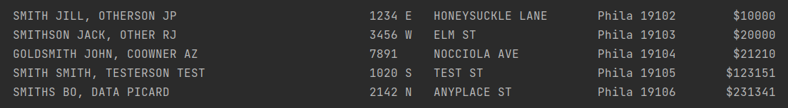

# propertiesSearch

propertiesSearch provides information about properties in the City of Philadelphia
by querying a publicly available, SQL-based API.

It provides functionality not available in the current Web application: the ability
to search by owner name.

## Overview
### Quick Start

Currently, running propertiesSearch allows you search Philadelphia properties by
owner name. The results include owner name and address, providing a
"white pages" functionality.

Entered search text matches any part of an owner name.

Sample output using test data is as follows:

Property value information (displayed above) is available by uncommenting a single line of
source code, but is disabled by default.

### More About Why I Wrote This
This client makes SQL requests via POST, enabling complex SQL queries, and calls 
the actively maintained Spring framework. 

Writing a client for the Carto SQL API also interested me because of the multiple
required string operations:

1) A user enters text to search.
2) This text, when inserted into an SQL query template, must not use
any reserved characters. For example, the program must be able to accept
`O'Brien`, a common name with an apostrophe, into a single-quoted SQL
parametrized query string.
3) The program must be able to store a parametrized query string in a format
that is easy to read and to debug, but is also compatible with Java's string
formatter. In particular, the `%` character has a different meaning for the
string formatter and for PostgreSQL.
4) Once formatted properly for SQL, the query string must be properly formatted
into JSON for POSTing to the API server.

Additionally, familiarity with the API allows you to perform useful analytics,
which I may explore in future versions.

### Current State Of The Program

Currently, the program supports console searching by user input and returns
a formatted table to the console. The number of results is limited and pre-set.

### Future Directions
Future versions may support CSV output, additional preset queries, arbitrary
queries, or a greater number or level of detail of results.

### Further Information
#### Wildcards
PostgreSQL wildcards are supported. `%` is a wildcard that matches any number
of characters. `_` is a wildcard that will match a single character.

Regardless, the beginning and end of the search string are treated as having
a `%` wildcard, so `Smith` matches `Smithson` or `Goldsmith`.

### Dependencies
The propertiesSearch source requires Spring Boot 2.5.2 and JUnit 4.12
in order to compile.

## Contact
To contact me, email .

## Legal
### License and Disclaimer of Warranty
This program is Copyright 2021 and licensed under AGPL v3.

However, I request as a courtesy that you do not distribute compiled binaries
outside of the developer community.

    This program is free software: you can redistribute it and/or modify
    it under the terms of the GNU Affero General Public License as published by
    the Free Software Foundation, either version 3 of the License, or
    (at your option) any later version.
    
    This program is distributed in the hope that it will be useful,
    but WITHOUT ANY WARRANTY; without even the implied warranty of
    MERCHANTABILITY or FITNESS FOR A PARTICULAR PURPOSE.  See the
    GNU Affero General Public License for more details.
    
    You should have received a copy of the GNU Affero General Public License
    along with this program.  If not, see <http://www.gnu.org/licenses/>.
